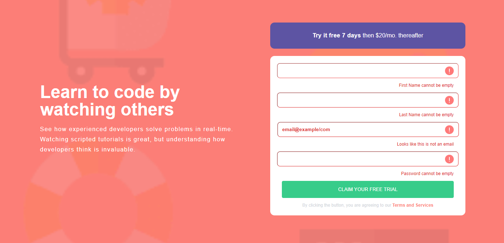
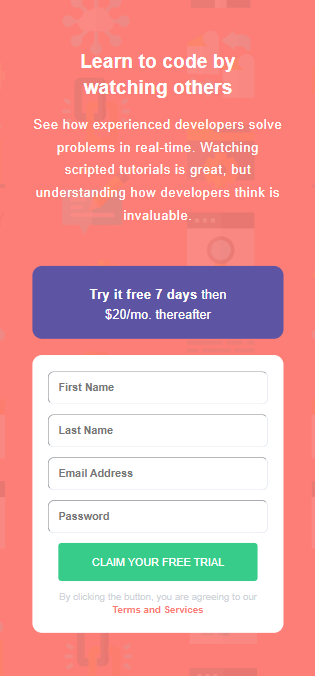
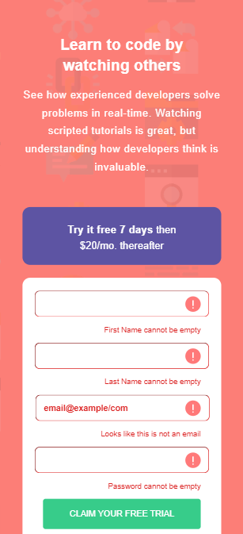

# Frontend Mentor - Intro component with sign up form solution

This is a solution to the [Intro component with sign up form challenge on Frontend Mentor](https://www.frontendmentor.io/challenges/intro-component-with-signup-form-5cf91bd49edda32581d28fd1).

## Table of contents

- [Overview](#overview)
  - [The challenge](#the-challenge)
  - [Screenshot](#screenshot)
  - [Links](#links)
- [My process](#my-process)
  - [Built with](#built-with)
  - [What I learned](#what-i-learned)
- [Author](#author)

## Overview

### The challenge

Users should be able to:

- View the optimal layout for the site depending on their device's screen size
- See hover states for all interactive elements on the page
- Receive an error message when the `form` is submitted if:
  - Any `input` field is empty. The message for this error should say _"[Field Name] cannot be empty"_
  - The email address is not formatted correctly (i.e. a correct email address should have this structure: `name@host.tld`). The message for this error should say _"Looks like this is not an email"_

### Screenshot






### Links

- Github URL: [Code Solution](https://github.com/ervinCodes/intro-component-with-signup-form/blob/main/src/components/Intro.jsx)
- Live Site URL: [Live Site](https://intro-cmpnt-with-signup-frm.netlify.app/)

## My process

### Built with

- Semantic HTML5 markup
- [TailwindCSS](https://tailwindcss.com/)
- Flexbox
- Mobile-first workflow
- [React](https://reactjs.org/) - JS library

### What I learned

This was more practice with conditional rendering and form validation with an email format check.   I learned how to conditionally render multiple errors on one input box and then removing those errors depending on the final submit.  In addition to this, conditionally rendering different styles and placeholders.

Below, is how I set the format on the email input using Regex and how to change state depending on the error:

```js
function handleSubmit(e) {
  e.preventDefault();
  let emailRegex =
    /^[a-zA-Z0-9.!#$%&'*+/=?^_`{|}~-]+@[a-zA-Z0-9-]+(?:\.[a-zA-Z0-9-]+)*$/;

  if (emailInput === "") {
    setEmailError("Email cannot be empty");
    setInvalidEmailError("");
  } else if (!emailInput.match(emailRegex)) {
    setInvalidEmailError("Looks like this is not an email");
    setEmailError("");
    setEmailInput("")
  } else {
    setEmailError(""); // Reset error state
    setInvalidEmailError(""); // Reset error state
  }
};
```

## Author

- Website - [My Portfolio](https://ervin-dev.netlify.app/)
- Frontend Mentor - [@ervincodes](https://www.frontendmentor.io/profile/ervinCodes)
- Twitter - [@ervin_dev](https://twitter.com/ervin_dev)
